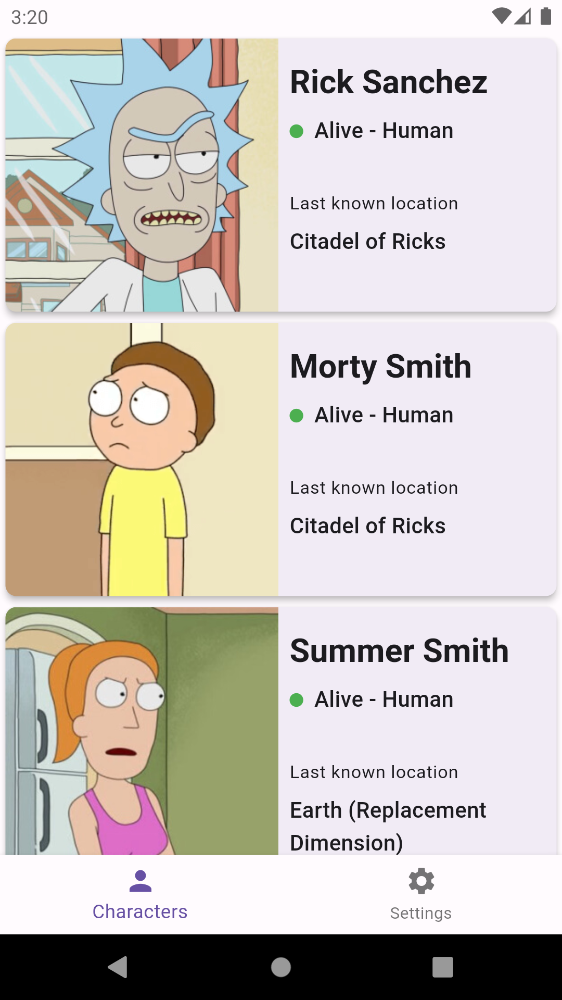
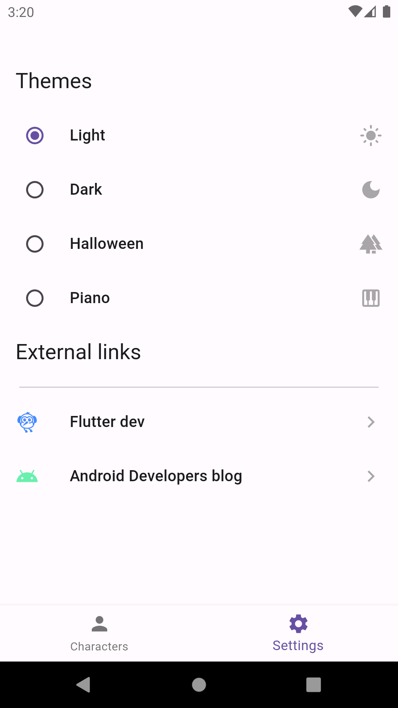
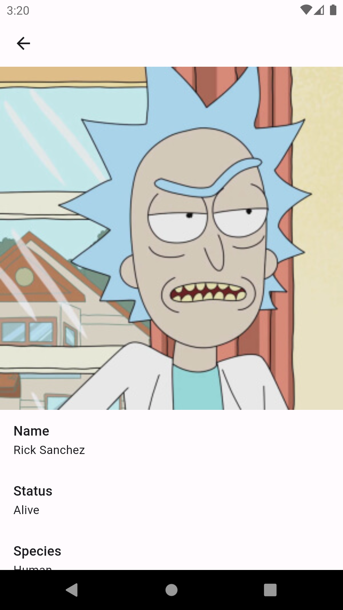

# rick-and-morty-flutter

## Sobre o projeto

O objetivo deste repositório é servir de base para um treinamento (_Learning Path_) chamado 'Flutter Hands on' que eu ministrei visando:

- Aplicar e mostrar conceitos de desenvolvimento para o Framework Flutter;

- Tornar desenvolvedores nativos (Android, Web e/ou iOS) produtivos em Flutter em um curto período de tempo;

- Apresentar o ferramental e bibliotecas necessários para criar um projeto Flutter com certo nível de qualidade respeitando padrões arquiteturais.

## Apresentação e resumo

O projeto lista dados referentes a API pública do  [Rick and Morty](https://rickandmortyapi.com/) de forma paginada exibindo detalhes dos personagens presentes na obra quando selecionados, bem como toda a navegação.

Em relação ao visual, o mesmo possui suporte a seleção de temas visuais: light, dark etc., em runtime. 

## Construção

* **Injeção de dependências**: **Get It** e **Injectable**: aproveito para deixar o link de um artigo que escrevi sobre o combo e uso de ambas as ferramentas em conjunto, [CLIQUE OU LEIA AQUI](https://medium.com/xp-inc/aprenda-a-escalar-seu-app-em-flutter-utilizando-uma-estrutura-de-injeção-de-dependências-2dd8ab8b3839);

* **Build Runner**;

* **Mocktail**;

* **Dio**;

* **Pretty Dio Logger**;

* **Equatable**;

* **Bloc**;

* **Bloc Concurrency**;

* **URL Launcher**;

* **Device Preview**;'

* **Google Fonts**;

* **Shared Preferences**;

* **Go Router**;

* **Bloc Test**.

## Showcase

---

  
  

## LICENSE
See [LICENSE](LICENSE)